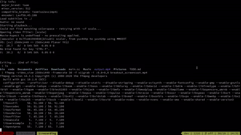

# Breakout
A simple example of writing a mini-game in `C++` with `SDL2`. Compile using
`make`. The SDL core library as well as `sdl_ttf` and `sdl_image` are required.
Because of potential copyright issues, assets aren't included. Thus, you need
to include a font as well as a texture for bricks and a sound file yourself (or
remove the related code).

# Demo

# License
This code is licensed under a [GPLv3 license](./LICENSE.md).
